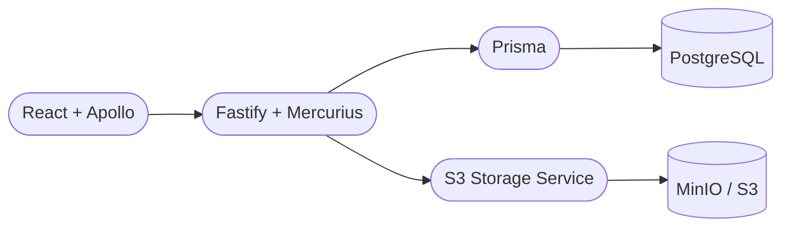

<h1 align="center">
  
</h1>

<p align="center">
  Plataforma full stack de gestão financeira pessoal — controle de receitas, despesas, categorias e dashboard analítico.
</p>

<p align="center">
  <a href="#-tecnologias">Tecnologias</a>&nbsp;&nbsp;|&nbsp;&nbsp;
  <a href="#-funcionalidades">Funcionalidades</a>&nbsp;&nbsp;|&nbsp;&nbsp;
  <a href="#-como-executar">Como Executar</a>&nbsp;&nbsp;|&nbsp;&nbsp;
  <a href="#-testes">Testes</a>&nbsp;&nbsp;|&nbsp;&nbsp;
  <a href="#-licença">Licença</a>
</p>

<p align="center">
  
  
  
  
</p>

---

## 🚀 Tecnologias

**Backend**


**Frontend**


**Qualidade & CI**


---

## ✨ Funcionalidades

- 🔐 Autenticação completa — cadastro, login e logout com sessão JWT
- 👤 Dados isolados por usuário em todas as operações
- 🗂️ CRUD completo de categorias
- 💸 CRUD completo de transações (receitas e despesas)
- 📊 Dashboard com resumo por período, por categoria e timeline
- 🧾 Upload de comprovantes via URL assinada (AWS S3 / MinIO)
- 🧪 Testes E2E e evidência visual automatizados com Playwright

Fluxo de autenticação:
- cadastro cria a conta e redireciona para `/login` com confirmação;
- somente `login` emite e persiste JWT de sessão.

---

## 🏗️ Arquitetura



Monorepo gerenciado com `pnpm workspaces`:

```text
.
├── backend/     # API GraphQL, Prisma, domínios (auth, category, transaction, storage)
├── frontend/    # App React, páginas protegidas, testes E2E
├── scripts/     # Smoke tests de integração local
└── .github/     # Workflows de CI, hooks e template de PR
```

---

## 🖥️ Como Executar

### Pré-requisitos

- [Node.js 20+](https://nodejs.org) + [pnpm 10.5+](https://pnpm.io) — `corepack enable`
- [Docker Desktop 24+](https://www.docker.com/products/docker-desktop/)
- Arquivo `.env` baseado em `.env.example`

### Desenvolvimento

```bash
# 1. Copie as variáveis de ambiente
cp .env.example .env

# 2. Suba o ambiente completo de desenvolvimento
pnpm compose:up
```

| Serviço | URL |
|---|---|
| Frontend | http://localhost:5173 |
| Style Guide | http://localhost:5173/style-guide |
| Backend / GraphQL | http://localhost:4000/graphql |
| MinIO Console | http://localhost:9001 |

No ambiente de desenvolvimento, o backend executa `prisma db push` automaticamente no startup do container.

Contrato de chamadas do frontend no desenvolvimento:
- o browser usa `/graphql`;
- o Vite faz proxy para `http://backend:4000` na rede Docker.

Para encerrar: `pnpm compose:down`

### Produção

```bash
# 1. Copie as variáveis de ambiente
cp .env.example .env

# 2. Suba o ambiente de produção
pnpm compose:up:prod

# Encerrar
pnpm compose:down:prod
```

Contrato de chamadas do frontend em produção:
- o frontend usa `VITE_BACKEND_URL` explícita;
- as chamadas seguem `${VITE_BACKEND_URL}/graphql` (sem proxy de desenvolvimento).

Configuração de exposição em produção:
- portas públicas: `5173` (frontend) e `4000` (backend);
- `postgres` e `minio` ficam apenas na rede interna Docker (sem publicação no host).

Observação de infraestrutura:
- os comandos usam projetos Docker separados (`financy-dev` e `financy-prod`) para evitar conflito entre stacks.

---

## 🧪 Testes

### E2E (Playwright)

Os testes E2E rodam em um container dedicado com Chromium pré-instalado.

```bash
# Suíte completa do Style Guide
pnpm test:e2e

# Apenas smoke E2E
pnpm test:e2e:smoke

# Evidência visual automatizada
pnpm test:e2e:visual
```

Para executar o smoke de browser no ambiente Docker:

```bash
pnpm smoke:auth:browser:docker
```

### Smoke tests (API GraphQL)

```bash
# Smoke completo da API (register, login, CRUD, upload)
pnpm smoke:graphql

# Regressão de autenticação (cenários positivos e negativos)
pnpm smoke:auth
```

Os relatórios E2E ficam em `frontend/playwright-report` após a execução.

---

## 🧭 Governança

- Licença: [MIT](LICENSE)
- Template de PR: [`.github/pull_request_template.md`](.github/pull_request_template.md)
- Revisões e aprovação: [`.github/CODEOWNERS`](.github/CODEOWNERS)
- Convenções de branch e contribuição: [CONTRIBUTING.md](CONTRIBUTING.md)
