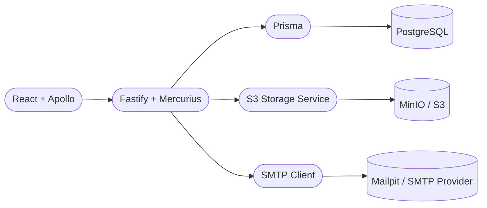

<h1 align="center">
  
</h1>

<p align="center">
  Plataforma full stack de gestão financeira pessoal — controle de receitas, despesas, categorias e dashboard analítico.
</p>

<p align="center">
  <a href="#-tecnologias">Tecnologias</a>&nbsp;&nbsp;|&nbsp;&nbsp;
  <a href="#-funcionalidades">Funcionalidades</a>&nbsp;&nbsp;|&nbsp;&nbsp;
  <a href="#-como-executar">Como Executar</a>&nbsp;&nbsp;|&nbsp;&nbsp;
  <a href="#-testes">Testes</a>&nbsp;&nbsp;|&nbsp;&nbsp;
  <a href="#-licença">Licença</a>
</p>

<p align="center">
  
  
  
  
</p>

---

## 🚀 Tecnologias

**Backend**


**Frontend**


**Qualidade & CI**


---

## ✨ Funcionalidades

- Autenticação completa — cadastro, login/logout com sessão JWT
- Dados isolados por usuário em todas as operações
- CRUD completo de categorias e transações (receitas/despesas)
- Dashboard com resumo por período, por categoria e timeline
- Upload de comprovantes via URL assinada (AWS S3 / MinIO)
- Recuperação de senha por OTP via e-mail
- Testes E2E e evidência visual automatizados com Playwright

---

## 🏗️ Arquitetura



```text
.
├── backend/            # API GraphQL, Prisma, domínios (auth, category, transaction, storage)
│   └── tests/          # Testes automatizados de API
├── frontend/           # App React, páginas protegidas
│   └── tests/e2e/      # Testes E2E unificados
│       ├── fixtures/   # Dados de seed (avatar, etc.)
│       ├── helpers/    # Utilitários (GraphQL client, video captions)
│       ├── support/    # Setup global e hooks de teste
│       ├── reference/  # Snapshots visuais de referência (versionados)
│       ├── results/    # Artefatos de execução (gitignored)
│       └── report/     # Relatório HTML do Playwright (gitignored)
├── scripts/            # Orquestração E2E e utilitários de ambiente
└── .github/            # Workflows de CI, hooks e template de PR
```

---

## 🖥️ Como Executar

### Pré-requisitos

- [Node.js 22+](https://nodejs.org) + [pnpm 10.5+](https://pnpm.io) — `corepack enable`
- [Docker Desktop 24+](https://www.docker.com/products/docker-desktop/)
- Nenhum `.env` obrigatório; os scripts carregam `.env.example` automaticamente.

### Desenvolvimento

```bash
pnpm dev:check   # valida contratos de env/compose (sem subir serviços)
pnpm dev         # sobe API, frontend, postgres, minio e mailpit
pnpm dev:logs    # acompanha logs da stack
pnpm dev:down    # encerra tudo e limpa volumes
```

| Serviço | URL |
|---------|-----|
| Frontend | http://localhost:5173 |
| Style Guide | http://localhost:5173/style-guide |
| Backend GraphQL | http://localhost:4000/graphql |
| Mailpit | http://localhost:8025 |
| MinIO Console | http://localhost:9001 |

O backend executa `prisma migrate deploy` e `prisma db seed` automaticamente no startup, criando a conta seed e dados iniciais.

**Políticas de ambiente:**
- `.env` é opcional — apenas para sobrescrever valores locais.
- `node_modules` Linux roda em volumes Docker nomeados (não compartilhado com host Windows).
- Frontend usa proxy Vite (`/graphql` → `http://backend:4000`).
- Arquivos temporários de debug devem ficar em `/.tmp-run/manual/`.

### Produção

O `docker-compose.yml` é exclusivo para desenvolvimento e CI. Em produção:
- Configure secrets reais na plataforma alvo.
- O frontend usa `VITE_BACKEND_URL` explícita (sem proxy Vite).
- Upload assinado requer `AWS_S3_ENDPOINT_INTERNAL`, `AWS_S3_ENDPOINT_PUBLIC` e `S3_PUBLIC_ORIGIN_HOSTS`.

---

## 🧪 Testes

### Validação completa

| Comando | O que faz |
|---------|-----------|
| `pnpm verify` | Lint + fix, validação de compose, backend e E2E — local (requer deps e stack de pé) |
| `pnpm verify:docker` | Sobe a stack e roda backend + E2E inteiramente via Docker |

### Comandos principais

| Comando | Escopo | Ambiente |
|---------|--------|----------|
| `pnpm test:backend` | Todas as suítes de backend | Local (requer stack de pé) |
| `pnpm test:backend:docker` | Todas as suítes de backend | Docker (sobe a stack) |
| `pnpm test:frontend` | Smoke + Contract + Journey | Local (requer stack de pé) |
| `pnpm test:frontend:docker` | Smoke + Contract + Journey | Docker |
| `pnpm test:frontend:demo-video` | Gera vídeo de evidência | Local |
| `pnpm test:frontend:demo-video:docker` | Gera vídeo de evidência | Docker |

O vídeo de evidência é salvo em `frontend/tests/e2e/results/` como `financy-demo-YYYY-MM-DD_HH-mm-ss.webm`.

### Suítes E2E individuais

Para diagnóstico ou execução focada (rodam localmente, requerem stack de pé):

| Comando | Tag | Descrição |
|---------|-----|-----------|
| `pnpm e2e:smoke` | `@smoke-login` | Login, signup e rotas públicas |
| `pnpm e2e:contract` | `@smoke-dashboard` | Dashboard, paginação e modais |
| `pnpm e2e:journey` | `@journey-full` | Jornada completa (com seed) |
| `pnpm e2e:ownership` | `@ownership` | Isolamento de dados por usuário |
| `pnpm e2e:transition` | `@transition` | Transições de rota animadas |
| `pnpm e2e:visual` | `@visual` | Comparação visual do style guide |

Para atualizar snapshots visuais de referência:

```bash
docker compose --env-file .env.example -p financy-dev -f docker-compose.yml \
  --profile e2e run --rm e2e sh -lc \
  "pnpm --filter @financy/frontend exec playwright test --workers=1 --grep @visual --update-snapshots"
```

### Conta seed (QA)

| Campo | Valor |
|-------|-------|
| Nome | `Financy Admin` |
| E-mail | `admin@financy.local` |
| Senha | `TestAdmin123!` |

Criada pelo `prisma db seed` no startup. Usada pelo `e2e-bootstrap` como base da jornada. Apenas para ambiente local.

---

## 🧭 Governança

- Licença: [MIT](LICENSE)
- Template de PR: [`.github/pull_request_template.md`](.github/pull_request_template.md)
- Code owners: [`.github/CODEOWNERS`](.github/CODEOWNERS)
- Contribuição: [CONTRIBUTING.md](CONTRIBUTING.md)
